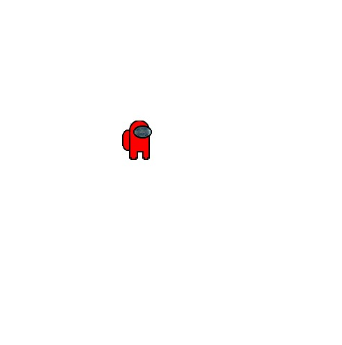
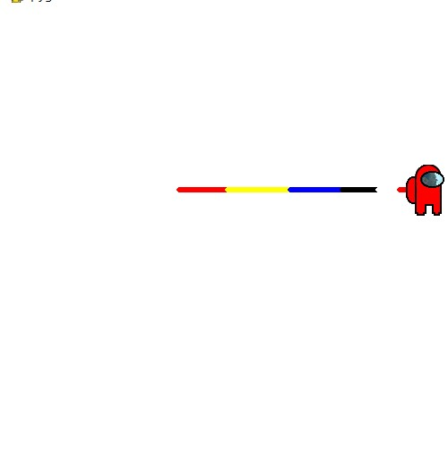
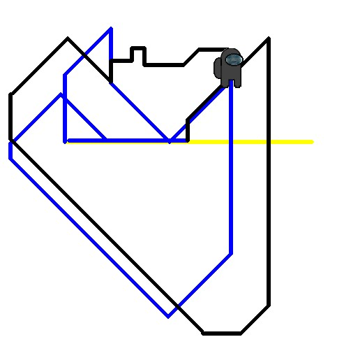

## AMONgus color pooper
### The BIG idea
We set out to create a highly relatable visually engaging artistic experience. We achieved this by incorporating visuals from both contemporary gaming culture and from relevant olin culture. We chose this method of achieving our goal of providing an interactive artistic experience because we wanted to make something that would appeal to a broad audience(on the scale of the Olin student body). Early on we decided on using pygame to allow the user to create art on the canvas. Through the process of creating this work, we enriched our own abilities to program, test, and display such an experience.

### Progam Features
Unique features of our project involve the use of user input and pygame to create pieces of art as produced by the user.  In the use of our program users can create unique pieces of art. We took inspiration from the etch-a-sketch toy to create this program's main functions. 

### Game Screenshots

### Project Video

### Installation instructions & download links
[Link to the ReadMe for installation](https://github.com/JakobFinci/AMONgus-color-pooper/blob/main/README.md#installation)
### GitHub page
[GitHub Link](https://github.com/JakobFinci/AMONgus-color-pooper)
### About Us
Our names are Eliyahu and Albert. We are artists.
### External resources
[Monkeys Spinning Monkeys - Kevin MacLeod](https://www.youtube.com/watch?v=cMTEcjwKIQw)

[Hollow Knight Piano Medley](https://www.youtube.com/watch?v=OjfJpUZy4Dk)

[Among Us steam page](https://store.steampowered.com/app/945360/Among_Us/)
